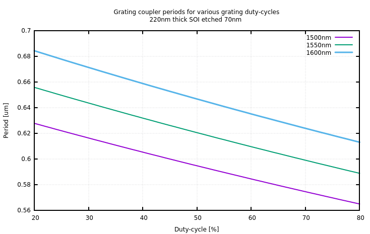
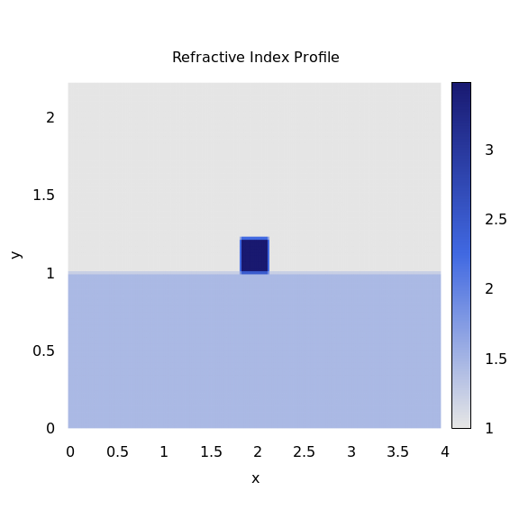
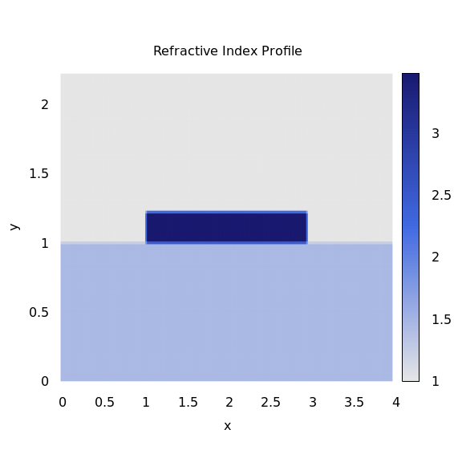
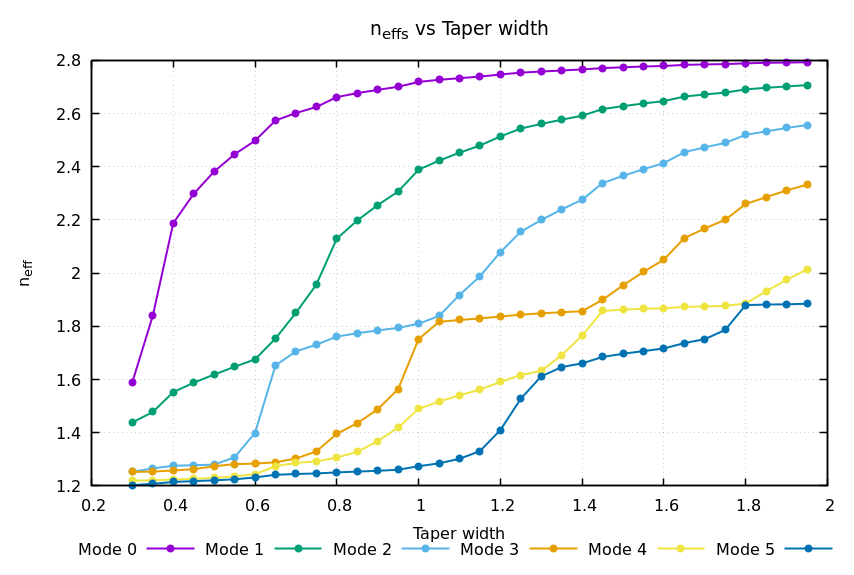
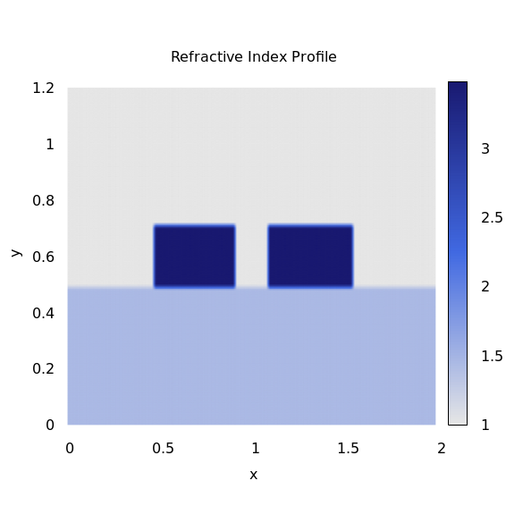
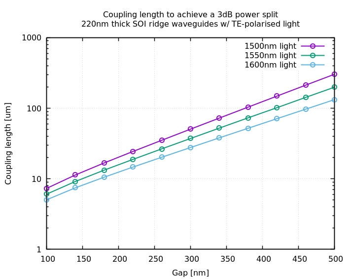

# modesolverpy
Photonic mode solver with a nice interface and output.
* semi-vectorial and fully vectorial options,
* simple structure drawing,
* automated data saving and plotting via Gnuplot,
* some limited (at this stage) data processing (finding MFD of fundamental mode), and
* easily extensible library

The documentation for this project can be found [here](http://modesolverpy.rtfd.io).

## Examples
* [Ex1: Semi-vectorial mode solving of a ridge waveguide](#example-1-semi-vectorial-mode-solving-of-a-ridge-waveguide)
* [Ex2: Fully vectorial mode solving of an anisotropic material waveguide](#example-2-fully-vectorial-mode-solving-of-anisotropic-material)
* [Ex3: Grating-coupler period](#example-3-grating-coupler-period)
* [Ex4: Mode Hybridisation In SOI](#example-4-mode-hybridisation-in-soi)
* [Ex6: Directional Coupler 3dB Length In SOI](#example-5-directional-coupler-3db-length-in-soi)

## Example 1: Semi-vectorial mode solving of a ridge waveguide
The following example finds the first two modes of a waveguide with the following, arbitrary, parameters:

* thin-film thickness: 500nm
* waveguide height: 400nm,
* waveguide width: 500nm,
* refractive index of waveguide: 3,
* refractive index of substrate: 1.4,
* refractive index of cladding: 1, and
* wavelength: 1550nm.

#### Python script
```python
import modesolverpy.mode_solver as ms
import modesolverpy.structure as st
import numpy as np

# All units are relative.  [um] were chosen in this case.
x_step = 0.02
y_step = 0.02
wg_height = 0.4
wg_width = 0.5
sub_height = 0.5
sub_width = 2.
clad_height = 0.5
n_sub = 1.4
n_wg = 3.
n_clad = 1.
film_thickness = 0.5
wavelength = 1.55
angle = 75.

structure = st.RidgeWaveguide(wavelength,
                              x_step,
                              y_step,
                              wg_height,
                              wg_width,
                              sub_height,
                              sub_width,
                              clad_height,
                              n_sub,
                              n_wg,
                              angle,
                              n_clad,
                              film_thickness)

structure.write_to_file('example_structure_1.dat')

mode_solver = ms.ModeSolverSemiVectorial(2, semi_vectorial_method='Ey')
mode_solver.solve(structure)
mode_solver.write_modes_to_file('example_modes_1.dat')
```

#### Structure


### Modes
 

## Example 2: Fully vectorial mode solving  of an anisotropic material waveguide
The following looks at a contrived ridge waveguide in Z-cut KTP.

The simulation outputs:
* 5 plots for each refractive index axis (n_xx, n_xy, n_yx, n_yy and n_zz),
* 48 plots for Ex, Ey, Ez, Hx, Hy and Hz,
* 8 effective index values, one for each mode,
* a wavelength sweep of the waveguide (plotting n_eff vs wavelength for each mode),
* whether a mode is qTE or qTM and the percentage overlap with TE and TM, and
* the group velocity of the mode.

The waveguide parameters are:
* thin-film thickness: 1.2um,
* waveguide height: 800nm,
* waveguide width: 1.2um,
* refractive index of waveguide: used Sellmeier equations to get n_xx, n_yy, n_zz at 1550nm,
* refractive index of substrate: used Sellmeier equation to get SiO2 at 1550nm,
* refractive index of cladding: 1, and
* wavelength: 1550nm.

### Python script
```python
import modesolverpy.mode_solver as ms
import modesolverpy.structure as st
import opticalmaterialspy as mat
import numpy as np

wl = 1.55
x_step = 0.06
y_step = 0.06
wg_height = 0.8
wg_width = 1.8
sub_height = 1.0
sub_width = 4.
clad_height = 1.0
film_thickness = 1.2
angle = 60.

def struct_func(n_sub, n_wg, n_clad):
    return st.RidgeWaveguide(wl, x_step, y_step, wg_height, wg_width,
                             sub_height, sub_width, clad_height,
                             n_sub, n_wg, angle, n_clad, film_thickness)

n_sub = mat.SiO2().n(wl)
n_wg_xx = mat.Ktp('x').n(wl)
n_wg_yy = mat.Ktp('y').n(wl)
n_wg_zz = mat.Ktp('z').n(wl)
n_clad = mat.Air().n()

struct_xx = struct_func(n_sub, n_wg_xx, n_clad)
struct_yy = struct_func(n_sub, n_wg_yy, n_clad)
struct_zz = struct_func(n_sub, n_wg_zz, n_clad)

struct_ani = st.StructureAni(struct_xx, struct_yy, struct_zz)
struct_ani.write_to_file()

solver = ms.ModeSolverFullyVectorial(8)
solver.solve(struct_ani)
solver.write_modes_to_file()

solver.solve_ng(struct_ani, 1.55, 0.01)

solver.solve_sweep_wavelength(struct_ani, np.linspace(1.501, 1.60, 21))
```

### Group Velocity
The group velocity at 1550nm for each mode is:
```
# modes_full_vec/ng.dat
# Mode idx, Group index
0,1.776
1,1.799
2,1.826
3,1.847
4,1.841
5,1.882
6,1.872
7,1.871
```

### Structure
  
 

### Modes
Only the first 4 (out of 8) modes are shown, and only the E-fields are shown (not H-fields).  For the rest of the images, look in the example folder or run the script.

A_{x,y,z} give the percentage power of that particular E-field component with respect to the total of all components.

Mode types:
```
# modes_full_vec/mode_info
# Mode idx, Mode type, % in major direction, n_eff
0,qTE,97.39,1.643
1,qTM,92.54,1.640
2,qTE,90.60,1.576
3,qTM,91.41,1.571
4,qTE,89.48,1.497
5,qTM,86.70,1.475
6,qTE,89.47,1.447
7,qTM,68.35,1.437
```
  
  
  
  

### Wavelength Sweep


## Example 3: Grating-coupler period
Analytic calculation of the grating coupler period for various duty-cycles in SOI.

Seems to match well with the periods in [Taillaert et al., _Grating Couplers for
Coupling between Optical Fibers and Nanophotonic Waveguides_, IOP Science, 2006](http://iopscience.iop.org/article/10.1143/JJAP.45.6071/meta).

```python
import modesolverpy.mode_solver as ms
import modesolverpy.structure as st
import modesolverpy.design as de
import opticalmaterialspy as mat
import numpy as np

wls = [1.5, 1.55, 1.6]
x_step = 0.05
y_step = 0.05
etch_depth = 0.07
wg_width = 10
sub_height = 0.5
sub_width = 14.
clad_height = 0.5
film_thickness = 0.22
polarisation = 'TE'
dcs = np.linspace(20, 80, 61) / 100

ed1 = etch_depth
ft1 = film_thickness
ed2 = ft1 - ed1
ft2 = ed2

periods = []
periods.append(dcs)

for wl in wls:
    ngc = []
    for ed, ft in [(ed1, ft1), (ed2, ft2)]:
        def struct_func(n_sub, n_wg, n_clad):
            return st.RidgeWaveguide(wl, x_step, y_step, ed, wg_width,
                                     sub_height, sub_width, clad_height,
                                     n_sub, n_wg, None, n_clad, ft)

        n_sub = mat.SiO2().n(wl)
        n_wg_xx = 3.46
        n_wg_yy = 3.46
        n_wg_zz = 3.46
        n_clad = mat.Air().n()

        struct_xx = struct_func(n_sub, n_wg_xx, n_clad)
        struct_yy = struct_func(n_sub, n_wg_yy, n_clad)
        struct_zz = struct_func(n_sub, n_wg_zz, n_clad)

        struct_ani = st.StructureAni(struct_xx, struct_yy, struct_zz)
        #struct_ani.write_to_file()

        solver = ms.ModeSolverFullyVectorial(4)
        solver.solve(struct_ani)
        #solver.write_modes_to_file()

        if polarisation == 'TE':
            ngc.append(np.round(np.real(solver.n_effs_te), 4)[0])
        elif polarisation == 'TM':
            ngc.append(np.round(np.real(solver.n_effs_tm), 4)[0])

    period = de.grating_coupler_period(wl, dcs*ngc[0]+(1-dcs)*ngc[1], n_clad, 8, 1)
    periods.append(period)

filename = 'dc-sweep-%s-%inm-etch-%i-film.dat' % (polarisation, etch_depth*1000, film_thickness*1000)
np.savetxt(filename, np.array(periods).T, delimiter=',', header=','.join([str(val) for val in wls]))
print(np.c_[periods])
```



## Example 4: Mode Hybridisation In SOI
Simulation of mode hybridisation in 220nm thick fully-etched SOI ridge
waveguides.

Results look the same as those found in [Daoxin Dai and Ming Zhang, "Mode hybridization and conversion in silicon-on-insulator nanowires with angled sidewalls," Opt. Express 23, 32452-32464 (2015)](https://www.osapublishing.org/oe/abstract.cfm?uri=oe-23-25-32452).

```python
import modesolverpy.mode_solver as ms
import modesolverpy.structure as st
import opticalmaterialspy as mat
import numpy as np

wl = 1.55
x_step = 0.02
y_step = 0.02
etch_depth = 0.22
wg_widths = np.arange(0.3, 2., 0.05)
sub_height = 1.
sub_width = 4.
clad_height = 1.
film_thickness = 0.22

n_sub = mat.SiO2().n(wl)
n_clad = mat.Air().n(wl)
n_wg = mat.RefractiveIndexWeb(
    'https://refractiveindex.info/?shelf=main&book=Si&page=Li-293K').n(wl)

r = []
for w in wg_widths:
    r.append(
        st.RidgeWaveguide(wl, x_step, y_step, etch_depth, w, sub_height,
                          sub_width, clad_height, n_sub, n_wg, None, n_clad,
                          film_thickness))

r[0].write_to_file('start_n_profile.dat')
r[-1].write_to_file('end_n_profile.dat')

solver = ms.ModeSolverFullyVectorial(6)
solver.solve_sweep_structure(r, wg_widths, x_label='Taper width', fraction_mode_list=[1,2])
solver.write_modes_to_file()
```

 


## Example 5: Directional Coupler 3dB Length In SOI
Analytic calculation of 3dB coupling length into two parallel SOI waveguides
with a varying gap at 3 different TE wavelengths.

An example refractive index profile for the two waveguides spaced 200nm is
shown.

```python
import modesolverpy.mode_solver as ms
import modesolverpy.structure as st
import modesolverpy.design as de
import opticalmaterialspy as mat
import numpy as np
import tqdm

wls = [1.5, 1.55, 1.6]
x_step = 0.02
y_step = 0.02
etch_depth = 0.22
wg_width = 0.44
sub_height = 0.5
sub_width = 2.
clad_height = 0.5
film_thickness = 0.22
gaps = np.linspace(0.1, 0.5, 11)

for wl in wls:
    lengths = []

    n_sub = mat.SiO2().n(wl)
    n_clad = mat.Air().n(wl)
    n_wg = 3.476

    for gap in tqdm.tqdm(gaps):
        r = st.WgArray(wl, x_step, y_step, etch_depth, [wg_width, wg_width], gap,
                       sub_height, sub_width, clad_height, n_sub, n_wg, None)
        #r.write_to_file()

        solver = ms.ModeSolverFullyVectorial(2)
        solver.solve(r)
        n1 = solver.n_effs_te[0]
        n2 = solver.n_effs_te[1]
        lengths.append(de.directional_coupler_lc(wl*1000, n1, n2)/2)

    filename = 'dc-sweep-%inm-%s-%inm-etch-%i-film.dat' % (wl*1000, 'TE', etch_depth*1000, film_thickness*1000)
    np.savetxt(filename, np.c_[gaps, lengths], delimiter=',', header='Coupling lengths (50\%)')
```




## Installation
It is recommend to install `modesolverpy` either via:

### Ubuntu/Mint/Debian:
```bash
pip3 install modesolverpy # or pip2 install modesolverpy
apt install gnuplot
```

### Arch Linux:
```bash
yaourt -S python-modesolverpy
```

### Dependencies
If installing using the [Arch Linux AUR package](https://aur.archlinux.org/packages/python-modesolverpy/) or `pip`, dependencies will be automatically downloaded and installed, if not, one should ensure the following dependencies are installed:

Either Gnuplot or Matplotlib can be used for plotting; I am a Gnuplot user to the code was written with it in mind.  If both Gnuplot and Matplotlib are installed, the code will default to Gnuplot.

* [setuptools](https://pypi.python.org/pypi/setuptools),
* [numpy](http://www.numpy.org/),
* [scipy](https://www.scipy.org/),
* [tqdm](https://pypi.python.org/pypi/tqdm), and
* [opticalmaterialspy](https://github.com/jtambasco/opticalmaterialspy).

#### Plotting
EITHER:

* [Gnuplot](http://www.gnuplot.info/).
* [gnuplotpy](https://github.com/jtambasco/gnuplotpy),

OR:

* [matplotlib](https://matplotlib.org/),

## Acknowledgments
This finite difference mode solver is based on a modified version of [EMpy](https://github.com/lbolla/EMpy).

Thank you to [Inna Krasnokutska](https://github.com/ikrasnokutska) for testing.
